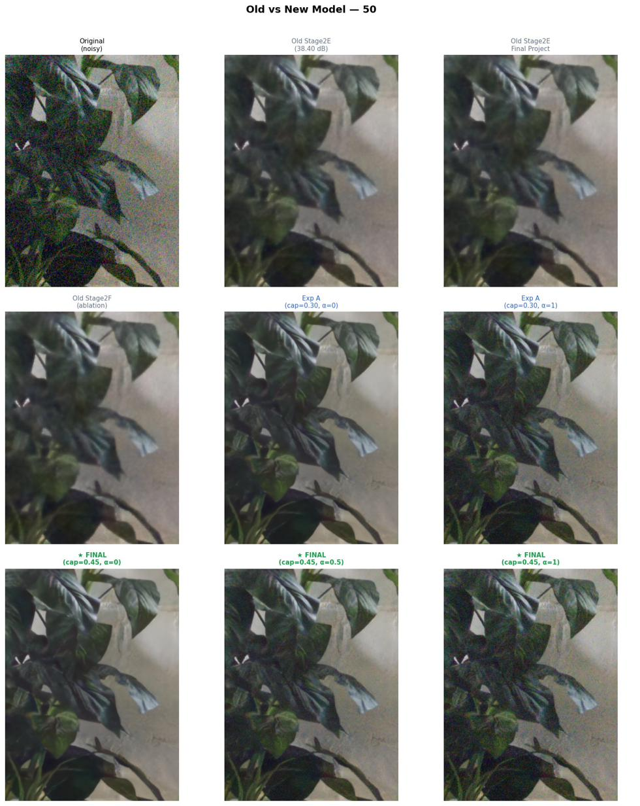
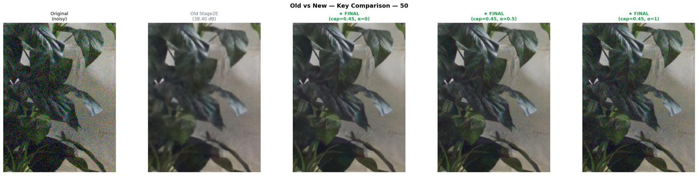
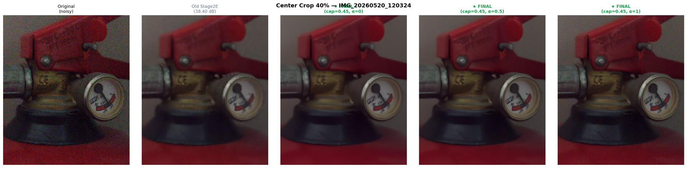

# NAFNet-Alpha: Controllable Smartphone Image Denoising

A deep learning model that removes noise from smartphone photos while letting the user control how much grain or texture stays in the output. The control is a single continuous parameter called alpha, and it is built directly into the network architecture — not applied as post-processing.

**Author:** Barbod Borhani — Artificial Intelligence, Bahcesehir University
**Course:** AIN3002 Deep Learning

## The Idea

Smartphone cameras in low-light conditions apply heavy automatic noise reduction that often makes photos look over-smoothed and plasticky. Fine surface details, fabric texture, and natural grain are removed along with the noise. Most existing denoising models apply a fixed level of processing with no way for the user to adjust the result.

NAFNet-Alpha addresses this by embedding alpha inside the model through FiLM conditioning layers and alpha-gated skip connections. Rather than blending noisy and clean images after the fact, the network changes its internal behavior based on alpha, producing genuinely different output styles from the same image.

| Alpha | What it does |
|-------|--------------|
| 0.00 | Maximum denoising, smoothest result |
| 0.20 | Balanced, natural-looking output (recommended default) |
| 0.50 | Moderate grain retention |
| 1.00 | Strong grain retention, closest to original texture |

Note that alpha=1 does not return the raw noisy image. The output formula `output = input - residual * (1 - 0.8 * alpha)` guarantees at least 20% of the predicted noise residual is always removed.

## Results

Measured on an internal validation set of 1,000 SIDD patches (not the official SIDD benchmark):

| Alpha | PSNR |
|-------|------|
| 0.00 | 42.60 dB |
| 0.50 | 38.85 dB |
| 1.00 | 34.64 dB |

The 7.96 dB spread between alpha=0 and alpha=1 gives a clearly visible difference in output style.

### Sample outputs on real phone photos

Full-frame comparison (original vs alpha=0 vs alpha=1):



Detail crops showing the alpha effect:





More examples are in `results/samples/`.

## Repository Structure

```
NAFNet-Alpha/
├── README.md
├── LICENSE
├── requirements.txt
├── src/
│   └── model.py                  <- model architecture (NAFNetAlpha)
├── scripts/
│   ├── run_inference.py          <- command-line inference on one image
│   ├── compare_all_models.py     <- comparison vs BM3D and DnCNN (Colab)
│   └── colab_single_image.py     <- minimal Colab cell for a quick test
├── notebooks/
│   └── NAFNet_Alpha_Demo.ipynb   <- full Colab demo (alpha sweep, modes)
├── configs/
│   └── final_config.json         <- training settings and final results
├── checkpoints/                  <- put the downloaded .pth here
├── docs/
│   └── DATASET.md                <- dataset details
├── results/
│   └── samples/                  <- selected comparison outputs
└── poster/
    └── NAFNet-Alpha-Poster.pdf   <- project poster
```

## Setup

```bash
git clone https://github.com/<your-username>/NAFNet-Alpha.git
cd NAFNet-Alpha
pip install -r requirements.txt
```

Then download the checkpoint `EXPB_FINAL_a0_42.60.pth` (81.8 MB) from the [Releases page](../../releases) and place it in `checkpoints/`.

The project was developed and tested with Python 3.10 on Google Colab (L4 GPU) and locally on an RTX 3070 Ti. CPU inference also works, just slower.

## How to Run

### Option 1 — Command line

```bash
python scripts/run_inference.py \
    --input path/to/your_image.jpg \
    --output path/to/result.png \
    --checkpoint checkpoints/EXPB_FINAL_a0_42.60.pth \
    --alpha 0.20
```

### Option 2 — Colab notebook

Open `notebooks/NAFNet_Alpha_Demo.ipynb` in Google Colab and run the cells in order. It loads the checkpoint, lets you upload test images, runs a full alpha sweep with detail crops, and saves everything.

### Option 3 — Single Colab cell

Paste `scripts/colab_single_image.py` into a Colab cell for the fastest possible test on one uploaded photo.

## Model Architecture

The model is based on NAFNet with two additions that make alpha part of the network itself:

- **AlphaFiLM layers** at the bottleneck and all four decoder levels: a small MLP maps alpha to per-channel scale and shift values that modulate the feature maps.
- **AlphaGatedSkip connections**: alpha controls a sigmoid gate on every encoder-to-decoder skip connection, deciding how much high-frequency detail flows through.

The network predicts a noise residual, and the final output is:

```
output = input - residual * (1.0 - 0.8 * alpha)
```

Total parameters: 20,379,939 (width=32, encoder blocks 2-2-4-8, 12 middle blocks, decoder blocks 2-2-2-2).

## Training Summary

Training used a two-stage strategy on SIDD only (see `docs/DATASET.md`):

1. **Stage 1:** train a strong plain denoiser (teacher), reaching 42.96 dB.
2. **Stage 2:** add alpha conditioning and fine-tune with a teacher preservation loss so quality at alpha=0 is not lost while the alpha behavior is learned.

Two fine-tuning experiments were run:

- **Experiment A** (ALPHA_CAP=0.30, lr 2e-5): stable, 42.58 dB at alpha=0, but the alpha effect was visually too subtle (5.45 dB spread).
- **Experiment B** (ALPHA_CAP=0.45, lr 1e-5, fresh AdamW): stronger alpha separation with no quality loss — 42.60 dB at alpha=0 and a 7.96 dB spread. Selected as the final model.

Full settings are in `configs/final_config.json`.

## Baselines

`scripts/compare_all_models.py` compares NAFNet-Alpha against BM3D (sigma=25/255) and the pretrained DnCNN color-blind model from [KAIR](https://github.com/cszn/KAIR) on real phone photos. Note the DnCNN baseline is trained on synthetic Gaussian noise, so near-identity behavior on real sensor noise is expected and documented in the script.

## Acknowledgments

- [NAFNet](https://github.com/megvii-research/NAFNet) (Chen et al., ECCV 2022) — base architecture
- [SIDD](https://www.eecs.yorku.ca/~kamel/sidd/) (Abdelhamed et al., CVPR 2018) — training data
- [FiLM](https://arxiv.org/abs/1709.07871) (Perez et al., AAAI 2018) — conditioning mechanism
- [KAIR](https://github.com/cszn/KAIR) — pretrained DnCNN baseline

## License

MIT — see [LICENSE](LICENSE).
